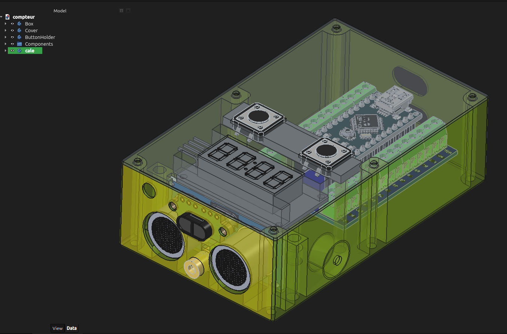
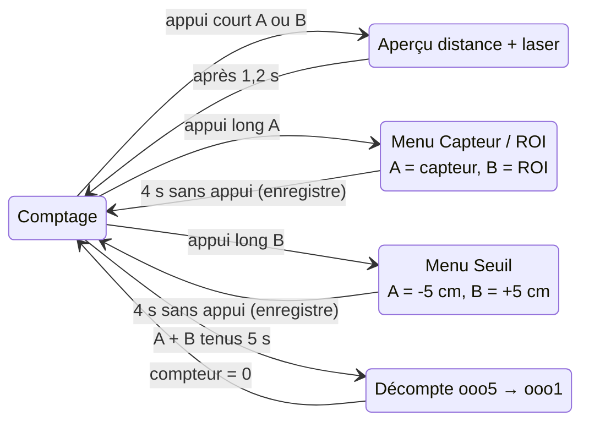

# Compteur de passages (Arduino Nano + ultrasons/ToF + TM1637)

🇫🇷 Français · 🇬🇧 [English version below](#english)

Boîtier autonome : un capteur à ultrasons **ou** un capteur temps-de-vol VL53L1X, fixé sur un côté du sas, compte les passages ; le total s'affiche sur un afficheur 7 segments 4 digits (TM1637). Les deux capteurs sont toujours câblés et actifs, le choix se fait au boîtier via un menu à boutons ou depuis la console série (voir plus bas) et persiste en EEPROM. Pas de réseau, pas de RTC, pas de SD.



*Vue 3D du boîtier (modèle FreeCAD `3D/compteur.FCStd`, couvercle rendu transparent). Face avant : les deux transducteurs du capteur ultrason, le capteur ToF VL53L1X (fenêtre noire entre les deux) et le module laser de pointage (cylindre doré en dessous). Dessus : l'afficheur TM1637 et les deux boutons A et B, tenus par le support de boutons. À l'intérieur : l'Arduino Nano monté sur une carte d'extension à borniers.*

## Sommaire

- [Démarrage rapide](#démarrage-rapide)
- [Récapitulatif des boutons](#récapitulatif-des-boutons)
- [Lire l'afficheur](#lire-lafficheur)
- [Signaux sonores](#signaux-sonores)
- [Matériel](#matériel)
- [Boîtier imprimé en 3D](#boîtier-imprimé-en-3d)
- [Câblage](#câblage)
- [Compilation et téléversement](#compilation-et-téléversement)
- [Console série](#console-série)
- [Fonctionnement détaillé](#fonctionnement-détaillé)
- [Réglages](#réglages)
- [Entrées vs passages](#entrées-vs-passages)
- [Limites connues](#limites-connues)
- [English](#english)

## Démarrage rapide

### Installation

1. **Placer le boîtier** sur un côté du sas, à environ **1 m du sol**, la face avant (capteurs) tournée vers le mur d'en face. Avec le capteur ultrason, ce mur doit être à **moins de 1,5 m** ; le ToF porte plus loin.
2. **Vérifier que rien ne gêne** le faisceau en temps normal (porte qui s'ouvre dans l'axe, porte-manteau, plante…) : tout objet entre le boîtier et le mur est pris pour une personne.
3. **Alimenter** le Nano en USB (chargeur 5 V ou powerbank, ~50 mA suffisent).

### Mise sous tension

1. **Le sas doit être vide** et le rester pendant quelques secondes : le boîtier mesure la distance au mur pour régler son seuil de détection.
2. Pendant la calibration, un **serpent lumineux** tourne sur l'afficheur (au moins 2 s) et le **laser de pointage** s'allume : son point rouge sur le mur montre où vise le boîtier. Ajuster l'orientation si besoin.
3. **Un bip** confirme la réussite, puis la **distance mesurée au mur** (en cm) s'affiche 2 s avec les deux-points qui clignotent, et le laser s'éteint.
4. Le **compteur** s'affiche : le boîtier compte. Le nombre repart de la dernière valeur enregistrée (il survit aux coupures de courant).

En cas d'échec (deux notes descendantes, `----` affiché au lieu de la distance) : rien ne sera compté. Vérifier la visée et le câblage, puis débrancher/rebrancher, ou changer de capteur via le menu (appui long sur A).

### Vérifier

- **Passer devant le capteur** : un bip court, le compteur augmente de 1.
- **Appui court sur A ou B** : la distance mesurée s'affiche ~1,2 s (deux-points clignotants) et le laser montre le point visé. Sas vide, on doit retrouver à peu près la distance du mur ; en passant devant, une distance plus courte.

### Au quotidien

- **Lire le compteur** : c'est le nombre brut de **passages** (une personne qui entre puis ressort compte 2). Voir [Entrées vs passages](#entrées-vs-passages).
- **Remettre à zéro** : maintenir **A et B ensemble 5 secondes**. Un décompte `ooo5` → `ooo1` s'affiche ; relâcher avant la fin annule.
- **Deux-points allumés en continu** : le capteur est bloqué (quelque chose stationne devant). Le comptage reprend seul dès que le passage est dégagé.

### Une fois l'installation terminée (optionnel)

- **Verrouiller les menus** pour qu'un passant ne puisse pas dérégler le boîtier : débrancher, maintenir **A seul**, rebrancher, garder appuyé ~1 s. `LOC` clignote 3 fois (verrouillé) ; refaire le geste pour déverrouiller (`OPEn`). L'aperçu distance et la remise à zéro restent possibles.
- **Mode silencieux** : même geste avec **A et B** maintenus ensemble à la mise sous tension. `8888` clignote = silencieux, `0` = sons rétablis.
- Pour un réglage plus fin (marge, temporisations, volume, luminosité…), brancher un ordinateur et utiliser la [console série](#console-série).

## Récapitulatif des boutons

Les deux boutons (A sur D3, B sur D2) partagent trois gestes : appui court, appui long d'un seul bouton (≥ 1,2 s) et appui long des deux ensemble (5 s). Leur effet dépend du moment où on les utilise.

### En usage normal (compteur affiché)

| Geste | Effet | Retour |
|---|---|---|
| Appui court sur **A** ou **B** (relâché avant 1,2 s) | **Aperçu distance** pendant ~1,2 s, laser de pointage allumé pendant ce temps. Le comptage continue en arrière-plan. | clic, distance (ou `----`) avec deux-points clignotant vite |
| Appui long sur **A seul** (≥ 1,2 s) | Ouvre le **menu Capteur / ROI** | deux notes montantes, nombre à 2 chiffres clignotant (ex. `11`) |
| Appui long sur **B seul** (≥ 1,2 s) | Ouvre le **menu Seuil** | deux notes montantes, nombre à 4 chiffres clignotant (ex. `0095`) |
| **A + B** maintenus **5 s** | **Remise à zéro** du compteur | décompte `ooo5` → `ooo1`, puis deux notes graves montantes |
| Appui long sur A ou B, **menus verrouillés** | Rien (le menu ne s'ouvre pas) | bip grave long, `LOC` pendant 1 s |

### Dans le menu Capteur / ROI (appui long sur A)

L'afficheur montre un nombre à 2 chiffres clignotant : **dizaines = capteur**, **unités = largeur du cône ToF**.

| Geste | Effet |
|---|---|
| Relâcher **A** | Bascule le capteur : `1x` = ultrason ↔ `2x` = ToF |
| Relâcher **B** | Change la largeur du cône ToF : `x1` = large (~27°) → `x2` = moyen (~20°) → `x3` = étroit (~15°) → `x1`… |
| **Ne rien toucher 4 s** | Valide, enregistre en EEPROM et ferme le menu (bip neutre). Recalibre si le capteur a changé, ou si la ROI a changé avec le ToF actif — **sas vide !** |

Exemples : `11` = ultrason (la ROI n'a alors pas d'effet), `21` = ToF large, `23` = ToF étroit.

### Dans le menu Seuil (appui long sur B)

L'afficheur montre le seuil de détection en cm sur 4 chiffres, clignotant. Il démarre sur le seuil manuel en cours, ou à défaut sur le seuil calibré arrondi au multiple de 5 inférieur.

| Geste | Effet |
|---|---|
| Relâcher **A** | −5 cm (de `0000` on repasse à `0200`) |
| Relâcher **B** | +5 cm (de `0200` on repasse à `0000`) |
| **Ne rien toucher 4 s** | Valide et ferme le menu (bip neutre) |

- Une valeur **non nulle** devient un **seuil manuel fixe** : plus aucune calibration automatique, ni au démarrage ni après un changement de capteur.
- **`0000` = retour au seuil automatique** : une calibration est relancée si on était en manuel (sas vide).
- ⚠️ Ouvrir ce menu par erreur puis le laisser se refermer **fige le seuil actuel en manuel**. Pour revenir en automatique : redescendre à `0000`, ou `set threshold auto` dans la console.

Dans les deux menus, le relâchement du bouton qui a servi à ouvrir le menu est ignoré, et le comptage est suspendu tant que le menu est ouvert.

### À la mise sous tension (boutons maintenus pendant la première seconde)

| Geste | Effet | Retour |
|---|---|---|
| **A seul** maintenu | Verrouille / déverrouille les menus de réglage | `LOC` (verrouillé) ou `OPEn` (déverrouillé) clignote 3 fois |
| **A + B** maintenus | Active / désactive le mode silencieux | `8888` (silencieux) ou `0` (sons actifs) clignote 3 fois |

Les deux réglages sont conservés en EEPROM.



## Lire l'afficheur

Le boîtier n'a pas de voyant : l'afficheur sert aussi d'indicateur d'état.

| Affichage | Signification |
|---|---|
| Un nombre fixe (ex. `418`) | Fonctionnement normal : nombre de passages comptés |
| Un nombre avec les **deux-points allumés en continu** | **Bloqué** : présence continue depuis plus de 10 s, comptage suspendu jusqu'au dégagement |
| **Serpent** qui tourne sur le contour | Calibration en cours : laisser le sas vide |
| Un nombre avec les **deux-points clignotant vite** | Distance mesurée (cm) : aperçu distance après un appui court, ou distance au mur pendant 2 s après une calibration |
| `----` (deux-points clignotants) | Aperçu distance : aucune lecture valide (traité comme une présence) |
| `----` pendant 2 s après le serpent | Échec de calibration |
| Nombre à **2 chiffres clignotant** (`11` … `23`) | Menu Capteur / ROI ouvert |
| Nombre à **4 chiffres clignotant** (`0000` … `0200`) | Menu Seuil ouvert |
| `ooo5` → `ooo1` (les `o` clignotent) | Remise à zéro en cours (A + B tenus) |
| `LOC` | Menus verrouillés (après un appui long, ou au démarrage) |
| `OPEn` clignotant 3 fois | Menus déverrouillés (au démarrage) |
| `8888` / `0` clignotant 3 fois au démarrage | Mode silencieux activé / désactivé |
| Un nombre affiché 1 s au démarrage | Seuil manuel en vigueur (pas de calibration) |

## Signaux sonores

| Son | Événement |
|---|---|
| Un bip court aigu | Passage compté |
| Un bip après le serpent | Calibration réussie |
| Deux notes descendantes | Capteur bloqué, ou échec de calibration |
| Deux notes montantes | Ouverture d'un menu |
| Clic très bref | Appui court (aperçu distance) ou changement de valeur dans un menu |
| Une note neutre | Fermeture d'un menu (choix enregistrés) |
| Deux notes graves montantes | Remise à zéro effectuée |
| Bip grave long | Appui long refusé : menus verrouillés |

En mode silencieux, aucun son n'est émis ; le réglage `volume` de la console raccourcit les bips pour les rendre plus discrets.

## Matériel

| Composant | Remarque |
|---|---|
| Arduino Nano | ATmega328P |
| HC-SR04 (intérieur) ou JSN-SR04T (robuste, zone morte ~20 cm) | capteur ultrason |
| VL53L1X (ex. carte Pololu) | capteur temps-de-vol, bus I2C |
| Afficheur 7 segments 4 digits TM1637 | module 4 fils |
| 2 boutons poussoir | reset / menus / aperçu distance |
| Buzzer piézo passif | bips de confirmation |
| Module diode laser 5V, basse puissance (classe 1 ou 2, <1 mW) | aide au pointage, ex. type KY-008 |
| Transistor NPN (2N2222/S8050 ou équivalent) + résistance ~1 kΩ | commande du laser depuis une sortie Nano |
| Alimentation | chargeur USB ou powerbank (~50 mA) |

## Boîtier imprimé en 3D

Le dossier [`3D/`](3D/) contient le modèle du boîtier :

| Fichier | Contenu |
|---|---|
| `compteur.FCStd` | modèle source FreeCAD : boîte (`Box`), couvercle (`Cover`), support de boutons (`ButtonHolder`), cale (`cale`) et les composants (Nano, capteurs, afficheur, boutons) pour vérifier l'encombrement |
| `compteur-Cover.3mf`, `compteur-ButtonHolder.3mf`, `compteur-cale.3mf` | pièces exportées, prêtes pour le trancheur |

Conseils de montage :

- Les transducteurs ultrason doivent **affleurer** la face avant : s'ils sont en retrait dans les trous, le son rebondit sur les bords et produit des échos parasites très courts.
- La fenêtre du ToF et le laser doivent rester dégagés ; le laser doit viser à peu près dans l'axe des capteurs pour que son point corresponde à la zone mesurée.
- L'afficheur et les boutons sont sur le dessus : repérer A (D3) et B (D2) sur le boîtier, par exemple avec les étiquettes de [`ETIQUETTES.md`](ETIQUETTES.md).

## Câblage

| Capteur / module | Broche Nano |
|---|---|
| HC-SR04 VCC | 5V |
| HC-SR04 GND | GND |
| HC-SR04 TRIG | D9 |
| HC-SR04 ECHO | D10 |
| VL53L1X VCC | 5V |
| VL53L1X GND | GND |
| VL53L1X SDA | A4 |
| VL53L1X SCL | A5 |
| TM1637 VCC | 5V |
| TM1637 GND | GND |
| TM1637 CLK | D4 |
| TM1637 DIO | D5 |
| Bouton A (une patte) | D3 |
| Bouton A (autre patte) | GND |
| Bouton B (une patte) | D2 |
| Bouton B (autre patte) | GND |
| Buzzer piézo (+) | D6 |
| Buzzer piézo (-) | GND |
| Module laser VCC | 5V |
| Module laser GND | collecteur du transistor |
| Base du transistor (via résistance ~1 kΩ) | D7 |
| Émetteur du transistor | GND |

Les boutons utilisent `INPUT_PULLUP`, aucune résistance externe n'est nécessaire.
Le branchement direct sur D6 convient à un piézo passif; un buzzer électromagnétique peut nécessiter un transistor.
Le module laser consomme typiquement 20 à 40 mA, trop pour une sortie Nano pilotée en direct : D7 commande un transistor NPN qui coupe l'alimentation du module côté masse, le module restant alimenté en 5V/GND.

⚠️ **Sécurité oculaire** : n'utiliser qu'un module laser basse puissance (classe 1 ou 2, <1 mW). Le firmware ne l'allume que pendant la calibration et l'aperçu distance, jamais en continu — ne pas le câbler "toujours allumé" dans l'axe d'un passage fréquenté. Seule exception : l'option `flash` de la console (désactivée par défaut) déclenche un flash de 80 ms à chaque passage compté, donc **dirigé vers la personne qui passe**, à environ 1 m de haut, c'est-à-dire à hauteur des yeux d'un enfant. La brièveté du flash (bien sous les 0,25 s du réflexe palpébral) est ce qui le rend acceptable avec un module de classe 1 ou 2 ; ne l'active jamais avec un laser plus puissant et n'allonge pas `LASER_FLASH_MS`.

⚠️ **Niveau logique I2C** : le bus I2C du Nano fonctionne en 5V. Certains modules VL53L1X bon marché n'ont ni régulateur ni translation de niveau et attendent du 3.3V strict sur SDA/SCL — vérifie la documentation du module avant de le câbler directement sur A4/A5 ; sinon alimente-le en 3.3V ou intercale un level-shifter I2C.

## Compilation et téléversement

```bash
pio run                      # compiler
pio run -t upload            # téléverser
pio device monitor           # console série de réglage (9600 bauds)
```

Au premier build, PlatformIO installe automatiquement les bibliothèques définies dans `platformio.ini` : l'affichage `smougenot/TM1637` et le capteur ToF `pololu/VL53L1X`.

Les traces de débogage détaillées sont désactivées par défaut (`DEBUG_SERIAL` à `0` dans `src/config.h`). Passe-le à `1` pour obtenir distance, état de présence, blocage et compteur toutes les secondes, mélangés à la console ; remets-le à `0` ensuite, ces messages occupent une part notable de la flash et de la RAM de l'ATmega328P. Pour un suivi ponctuel, la commande `watch` de la console suffit.

Deux environnements sont fournis selon le bootloader de la carte :

```bash
pio run -e nano_new -t upload   # Nano d'origine (bootloader récent)
pio run -e nano_old -t upload   # la plupart des clones CH340
```

Si le téléversement échoue avec l'erreur `not in sync`, essaie l'autre environnement.

## Console série

La console série est toujours active : branche le Nano en USB et ouvre `pio device monitor` (ou le moniteur série de l'IDE Arduino, 9600 bauds, fin de ligne « Nouvelle ligne »). Tape une commande par ligne (commandes et messages en anglais) :

| Commande | Effet |
|---|---|
| `help` ou `?` | liste des commandes et des paramètres, avec leurs bornes |
| `status` | tous les réglages et l'état courant (capteur, seuil, distance, compteur, présence, blocage) |
| `set <param> <valeur>` | modifie un réglage, l'applique tout de suite et l'enregistre en EEPROM |
| `cal` | relance une calibration (sans effet si le seuil est manuel) |
| `count <n>` / `reset` | fixe le compteur / le remet à zéro |
| `watch` | affiche distance, seuil, présence, blocage et compteur 4 fois par seconde ; retape `watch` (ou n'importe quelle commande) pour arrêter |
| `laser on` / `laser off` | allume le laser de pointage, extinction automatique au bout de 30 s |
| `reboot` | redémarrage logiciel : relance le programme et la calibration (sas vide). Le compteur et les réglages sont déjà enregistrés, rien n'est perdu |
| `defaults` | remet les réglages par défaut (le compteur, le capteur, la ROI, le seuil et le mode silencieux sont conservés ; le verrouillage des menus est levé) |

| Paramètre | Valeurs | Défaut | Rôle |
|---|---|---|---|
| `sensor` | `us` / `tof` | `us` | capteur actif (recalibre) |
| `roi` | `large` / `medium` / `narrow` (ou `1`/`2`/`3`) | `large` | largeur du cône ToF (recalibre si ToF actif) |
| `threshold` | `auto` ou 10–400 cm | `auto` | seuil manuel, ou retour à la calibration automatique |
| `flash` | `on` / `off` | `off` | flash laser bref (80 ms) à chaque passage compté — voir l'avertissement de sécurité |
| `mute` | `on` / `off` | `off` | mode silencieux |
| `lock` | `on` / `off` | `off` | verrouille les menus de réglage aux boutons (aperçu distance et reset restent possibles) |
| `margin` | 5–100 cm | 20 | marge sous la distance au mur (recalibre) |
| `confirm` | 1–10 | 2 | lectures concordantes pour valider une arrivée |
| `clear` | 100–5000 ms | 500 | vide continu avant de pouvoir compter un nouveau passage |
| `block` | 1000–60000 ms | 10000 | présence continue avant l'état « bloqué » |
| `volume` | 0–100 % | 50 | durée relative des bips (volume perçu) |
| `brightness` | 0–7 | 5 | luminosité de l'afficheur |
| `budget` | 33–200 ms | 50 | budget de mesure du ToF |
| `ping` | 60–150 ms | 70 | délai minimal entre deux pings ultrason |

Exemple :

```
> set margin 30
margin=30 cm
threshold=97 cm (auto)
> watch
d=127 threshold=97 present=0 blocked=0 n=418
```

⚠️ Ouvrir le moniteur série **redémarre le Nano** (signal DTR de l'USB) : la calibration de démarrage se relance, il faut donc que le sas soit vide à ce moment-là. Les menus à boutons restent disponibles et partagent les mêmes réglages : une commande tapée pendant qu'un menu bouton est ouvert est exécutée à sa fermeture.

## Fonctionnement détaillé

- **Calibration** au démarrage (et après tout changement de capteur via le menu ou la console) : le boîtier mesure la distance au mur d'en face avec le capteur actif (médiane de `CALIBRATION_SAMPLES` lectures valides, pour qu'une mesure parasite ne fausse pas le seuil) et fixe le seuil de détection à cette distance moins la marge (`margin`, 20 cm par défaut). **Allume-le sas vide.** Pendant la calibration, un serpent lumineux tourne sur le contour de l'afficheur (au moins `CALIBRATION_MIN_MS`) et le laser de pointage s'allume pour vérifier/ajuster l'alignement ; un bip confirme sa réussite, la distance mesurée s'affiche 2 s (`CALIBRATION_FEEDBACK_MS`) avec les deux-points clignotants, puis le laser s'éteint. Si le capteur ne renvoie aucune lecture valide (pas d'écho côté ultrason, pas de mesure valide ou capteur non détecté côté ToF), la calibration abandonne au bout de `CALIBRATION_TIMEOUT_MS` (10 s) (même échec si le mur mesuré est plus proche que la marge, ce qui donnerait un seuil nul ou négatif) : deux notes descendantes retentissent et `----` s'affiche, signe d'un problème de câblage ou de visée. Le seuil précédent est conservé (au démarrage il n'y en a pas : rien n'est compté tant qu'une calibration n'a pas réussi, via le menu ou un redémarrage).
- **Seuil manuel** : au lieu de la calibration, on peut imposer un seuil fixe, depuis le menu Seuil (appui long sur B, pas de 5 cm, 5–200 cm) ou la console (`set threshold 10…400`). Il est enregistré en EEPROM ; au démarrage, il est affiché 1 s à la place du serpent et aucune calibration n'a lieu, même après un changement de capteur. `0000` dans le menu ou `set threshold auto` reviennent à la calibration automatique (et la relancent).
- **Détection** : `confirm` mesures concordantes (2 par défaut) sont nécessaires pour valider une arrivée (anti-parasites), et le passage n'est considéré terminé qu'après `clear` (0,5 s par défaut) de vide continu : un mouvement de bras, un sac ou une lecture instable pendant le même passage ne sont donc comptés qu'une fois. Contrepartie : deux personnes qui se suivent à moins d'environ 0,5 s sont comptées une seule fois. Un bip court confirme chaque passage compté à l'arrivée. Une absence de lecture valide est volontairement traitée comme une présence, pas comme un sas vide.
- **Blocage** : si quelque chose reste plus de `block` (10 s par défaut) devant le capteur, le comptage est suspendu jusqu'à ce que le passage se libère. Le **deux-points allumé** et deux notes descendantes signalent le blocage.
- **Menu Capteur / ROI** : un appui long (`LONG_PRESS_MS`, 1,2 s) sur le **bouton A** seul ouvre ce menu — deux notes montantes le confirment. L'afficheur montre un nombre à 2 chiffres clignotant : le chiffre des dizaines choisit le capteur (`1` = ultrason, `2` = ToF) et bascule à chaque relâchement du **bouton A** ; le chiffre des unités choisit la largeur du cône de détection ToF (`1` = large ~27°, `2` = moyen ~20°, `3` = étroit ~15°, voir « Limites connues ») et avance d'un cran à chaque relâchement du **bouton B**. Les deux réglages sont indépendants et peuvent être changés dans n'importe quel ordre avant la validation. Sans activité pendant `MENU_TIMEOUT_MS` (4 s), le menu se referme (bip neutre), les deux choix sont enregistrés en EEPROM, et une nouvelle calibration démarre automatiquement (sauf seuil manuel) si le capteur a changé, ou si la largeur ROI a changé et que le ToF est le capteur actif. Pendant que le menu est ouvert, le comptage est entièrement suspendu et reprend exactement où il en était à la sortie.
- **Menu Seuil** : un appui long sur le **bouton B** seul ouvre ce menu. L'afficheur montre le seuil en cm sur 4 chiffres, clignotant, initialisé au seuil manuel en cours ou, en mode automatique, au seuil calibré arrondi au multiple de 5 inférieur (plafonné à 200). Chaque relâchement de **A** retire 5 cm, chaque relâchement de **B** en ajoute 5 (la valeur boucle entre 0 et 200). Après 4 s sans appui, la valeur est validée : `0` remet le seuil automatique, toute autre valeur devient le seuil manuel. Comme pour l'autre menu, le comptage est suspendu pendant ce temps.
- **Remise à zéro** : il faut maintenir les **deux boutons** enfoncés ensemble pendant `RESET_HOLD_MS` (5 s) — motif sonore dédié (deux notes graves montantes) à la fin. Pendant l'attente, l'afficheur montre trois petits `o` clignotants (le compteur va repasser à 0) suivis d'un décompte en secondes (`ooo5`, `ooo4` … `ooo1`) à la place du compteur, pour savoir où on en est et pouvoir relâcher avant la remise à zéro si c'était involontaire.
- **Aperçu distance** : en usage normal (hors menu), un appui court sur l'un ou l'autre bouton (relâché avant `LONG_PRESS_MS`) affiche pendant `PEEK_DURATION_MS` (~1,2 s) la distance instantanée mesurée par le capteur actif (`----` si aucune lecture valide), avec les deux-points qui clignotent rapidement pour la distinguer du compteur, et allume le laser de pointage pour le même intervalle — pratique pour vérifier l'alignement après l'installation sans relancer une calibration — sans interrompre le comptage en arrière-plan.
- **Verrouillage des menus** : une fois l'installation réglée, on peut interdire l'ouverture des deux menus de réglage par appui long, pour qu'un passant ne puisse pas dérégler le boîtier. L'aperçu distance (appui court) et la remise à zéro (deux boutons 5 s) restent disponibles. Pour basculer le verrou, maintenir le **bouton A seul** à la mise sous tension : l'afficheur clignote 3 fois `LOC` (verrouillé) ou `OPEn` (déverrouillé). On peut aussi taper `set lock on` / `set lock off` dans la console série. Quand le verrou est actif, un appui long produit un bip grave et affiche `LOC` pendant `LOCKED_NOTICE_MS` (1 s) au lieu d'ouvrir le menu. Le réglage persiste en EEPROM ; `defaults` le lève.
- **Mode silencieux** : au démarrage, si les deux boutons sont maintenus appuyés simultanément (avant ou juste après la mise sous tension), le mode silencieux bascule (activé ↔ désactivé). L'afficheur clignote 3 fois pour confirmer : `8888` signale le mode muet, `0` le retour des sons. Ce réglage persiste en EEPROM (aussi modifiable par `set mute on|off`). Lorsque le mode est actif, tous les bips sont désactivés (comptage, calibration, menu, reset, blocage), mais le compteur et toutes les fonctionnalités continuent de fonctionner normalement.
- **Contrôle du volume** : le réglage `volume` de la console série (0-100%, défaut 50) réduit la durée des bips pour les rendre **perçus** plus discrets (ce n'est pas un vrai contrôle d'amplitude). À 50%, les bips durent la moitié du temps (17,5 ms au lieu de 35 ms), ce qui les rend moins intrusifs sans compromettre leur audibilité. En dessous de 30-40%, ils risquent d'être trop courts pour être utiles. Ce réglage persiste en EEPROM ; il complète le mode silencieux pour un contrôle gradué entre « plein volume » et « muet ».
- **Sauvegarde** : le compteur, le capteur sélectionné, la ROI, le seuil manuel et le mode silencieux sont conservés en EEPROM après une coupure ou un redémarrage. La remise à zéro est également enregistrée. Les réglages de la console série (`margin`, `confirm`, `clear`, `block`, `volume`, `brightness`, `budget`, `ping`, `flash`, `lock`) occupent un bloc séparé de 24 octets en fin d'EEPROM, réécrit seulement quand on les modifie. Les écritures du compteur tournent sur ~83 emplacements de l'EEPROM (au lieu d'une adresse fixe) pour répartir l'usure ; au démarrage, le firmware relit tous les emplacements pour retrouver le plus récent valide.

## Réglages

Tout est regroupé dans `src/config.h`. Les valeurs `DEFAULT_*` ne sont que les valeurs par défaut des réglages modifiables depuis la console série (`set …`) ; les autres constantes nécessitent une recompilation.

| Constante | Rôle | Défaut |
|---|---|---|
| `DEFAULT_MARGIN_CM` | marge sous la distance au mur pour détecter (console : `margin`) | 20 |
| `DEFAULT_CONFIRM_READS` | lectures concordantes requises pour une arrivée (console : `confirm`) | 2 |
| `DEFAULT_CLEAR_HOLD_MS` | vide continu requis avant de pouvoir compter un nouveau passage (console : `clear`) | 500 |
| `DEFAULT_MAX_PRESENCE_MS` | délai avant l'état « bloqué » (console : `block`) | 10000 |
| `LOOP_DELAY_MS` | pause entre deux mesures | 40 |
| `CALIBRATION_BEEP_HZ` | fréquence du bip de fin de calibration | 1600 |
| `COUNT_BEEP_HZ` | fréquence du bip de confirmation | 2200 |
| `BLOCKED_BEEP_FIRST_HZ` | fréquence de la première note de blocage | 1100 |
| `BLOCKED_BEEP_SECOND_HZ` | fréquence de la seconde note de blocage | 700 |
| `BEEP_DURATION_MS` | durée de chaque note (ms) | 35 |
| `DEFAULT_VOLUME_PERCENT` | volume du buzzer (0-100%), réduit la durée des bips (console : `volume`) | 50 |
| `DEFAULT_BRIGHTNESS` | luminosité de l'afficheur, 0-7 (console : `brightness`) | 5 |
| `CALIBRATION_MIN_MS` | durée minimale de l'animation de calibration | 2000 |
| `CALIBRATION_TIMEOUT_MS` | abandon de la calibration sans lecture valide | 10000 |
| `CALIBRATION_FEEDBACK_MS` | affichage de la distance mesurée après la calibration | 2000 |
| `SNAKE_STEP_MS` | vitesse du serpent (ms par image) | 80 |
| `EEPROM_SLOT_COUNT` | nombre d'emplacements de l'anneau EEPROM (voir plus bas) | ~83 |
| `DEFAULT_US_PING_MS` | délai minimal entre deux pings ultrason, datasheet HC-SR04 : ≥ 60 ms (console : `ping`) | 70 |
| `US_MIN_VALID_CM` | une lecture ultrason isolée plus courte est ignorée comme parasite | 10 |
| `CALIBRATION_SAMPLES` | lectures valides dont la médiane sert au calibrage | 5 |
| `LASER_FLASH_MS` | durée du flash laser à chaque passage compté (option `flash`), à garder bien sous 250 ms | 80 |
| `LASER_MAX_ON_MS` | extinction automatique du laser allumé par `laser on` | 30000 |
| `EEPROM_MAGIC` | signature validant le contenu EEPROM (dans `src/storage.cpp`) | 0x5048 |
| `LONG_PRESS_MS` | appui seul tenu pour ouvrir un menu | 1200 |
| `RESET_HOLD_MS` | les deux boutons tenus pour remettre à zéro (affiche `ooo5`→`ooo1`, les `o` clignotent) | 5000 |
| `MENU_TIMEOUT_MS` | inactivité dans un menu avant validation/sortie | 4000 |
| `MENU_BLINK_MS` | clignotement de l'afficheur en mode menu | 300 |
| `PEEK_DURATION_MS` | durée d'affichage de l'aperçu distance | 1200 |
| `RESET_BLINK_MS` | cadence de clignotement des petits `o` pendant le décompte de remise à zéro | 250 |
| `PEEK_BLINK_MS` | cadence de clignotement des deux-points pendant l'aperçu distance | 100 |
| `MENU_ENTER_BEEP_FIRST_HZ` / `MENU_ENTER_BEEP_SECOND_HZ` | notes d'entrée dans un menu | 1800 / 2400 |
| `MENU_EXIT_BEEP_HZ` | note de sortie d'un menu | 1500 |
| `RESET_BEEP_FIRST_HZ` / `RESET_BEEP_SECOND_HZ` | notes de confirmation du reset | 500 / 900 |
| `CLICK_BEEP_HZ` / `CLICK_DURATION_MS` | clic de changement de valeur / aperçu distance | 3000 / 15 |
| `DEFAULT_BUTTON_LOCK` | menus de réglage aux boutons verrouillés par défaut (console : `lock`) | 0 |
| `LOCKED_BEEP_HZ` | bip grave d'un appui long quand les menus sont verrouillés | 400 |
| `LOCKED_NOTICE_MS` | durée d'affichage de `LOC` après un appui long verrouillé | 1000 |
| `DEFAULT_TOF_BUDGET_MS` | budget de mesure ToF en ms (console : `budget`) | 50 |

## Entrées vs passages

L'affichage montre le nombre brut de passages. Si chaque visiteur entre puis ressort, les entrées valent environ `passages / 2` : remplace `passCount` par `passCount / 2` dans les deux appels d'affichage. Le brut a l'avantage de révéler qu'une personne est encore à l'intérieur quand le chiffre est impair.

## Limites connues

- Le capteur est placé à environ 1 m du sol et vise un mur à moins de 1,5 m : au-delà, l'absence d'écho se confond avec un passage.
- Deux personnes côte à côte sont comptées une seule fois.
- Les vêtements épais absorbent l'écho : la présence est alors maintenue plus longtemps que le passage réel, ce qui peut finir par déclencher l'état « bloqué ».
- Chaque passage compté déclenche une écriture EEPROM. Grâce à la rotation sur ~83 emplacements (wear-leveling), l'endurance effective passe d'environ 100 000 à environ 8,3 millions d'écritures au lieu de réutiliser toujours la même adresse.
- Réduire la largeur ROI du ToF (menu, niveau « moyen » ou « étroit ») diminue le cône de détection pour limiter le risque de double-détection latérale, mais réduit aussi la quantité de lumière réfléchie captée : portée utile plus courte et mesures plus bruitées, surtout combiné au mode de distance `Long` déjà actif dans le firmware.
- Le budget de mesure ToF (`set budget …`) contrôle le temps d'intégration du capteur ToF : plus il est élevé, meilleure est la portée et plus le signal est propre, mais le taux de mesure diminue. La valeur par défaut de 50 ms maintient un bon taux d'échantillonnage (~20 Hz) mais peut nécessiter d'être augmentée en conditions difficiles. Si le capteur retourne systématiquement `range_status=7` (signal trop faible), augmenter ce réglage à 100 ou 140 ms (`set budget 100`) — au-delà de 40 ms, chaque mesure ralentit d'autant la boucle de détection — ou vérifier les conditions d'installation (distance au mur, réflectivité, lumière ambiante).
- L'afficheur n'a que 4 chiffres : au-delà de 9999 passages l'affichage n'est plus lisible, même si le compteur interne monte jusqu'à 65535.
- Si le mode ToF est sélectionné dans le menu alors que le VL53L1X n'est pas branché (ou n'a pas répondu au démarrage), la calibration échoue après `CALIBRATION_TIMEOUT_MS` (10 s) et le seuil précédent est conservé. Il faut rebrancher le capteur ou rebasculer sur le mode ultrason via le menu.
- Le menu Seuil ne va que jusqu'à 200 cm (la console accepte jusqu'à 400) : un seuil manuel plus grand fixé par la console est ramené à 200 si on ouvre puis referme ce menu.
- Les menus et l'aperçu distance utilisent les mêmes deux boutons que le reset : un relâchement lors d'une tentative de reset abandonnée (un bouton relâché avant les 2 s) peut déclencher un aperçu distance furtif sans conséquence.
- Le laser de pointage ne s'allume que pendant la calibration et l'aperçu distance ; si un menu est ouvert pendant qu'un aperçu distance est encore actif, le laser peut rester allumé un peu plus longtemps que `PEEK_DURATION_MS` jusqu'à la fermeture du menu (cas rare, sans conséquence).
- Les gestes de démarrage (mode silencieux, verrouillage) nécessitent de maintenir les boutons dès la mise sous tension : le système attend 1 seconde avant de vérifier leur état, donc ils doivent être maintenus pendant au moins cette durée.
- Le HC-SR04 renvoie parfois des distances très courtes (< 10 cm) sans raison. Le firmware espace les pings d'au moins 70 ms (réglable avec `set ping`, 60 ms minimum selon le datasheet) et ignore une lecture courte isolée (deux de suite sont acceptées : un objet réellement collé au capteur reste détecté) ; `status` dans la console affiche le nombre de lectures ignorées (`glitches=`). Si ce nombre grimpe vite, vérifie le matériel : transducteurs affleurant le couvercle (s'ils sont en retrait dans les trous, le son rebondit sur les bords), condensateur de découplage (100 µF + 100 nF) au plus près du VCC du capteur, fils TRIG/ECHO courts.
- `reboot` relance le programme par un saut logiciel au début du code, pas par un reset matériel du watchdog : l'ancien bootloader des clones Nano (`nano_old`) ne supporte pas ce dernier et redémarre en boucle jusqu'à une coupure d'alimentation.

### Mises à jour du firmware et EEPROM

- Chaque changement du format d'enregistrement du compteur (nouvel `EEPROM_MAGIC`, actuellement `0x5048` depuis l'ajout du seuil manuel) fait repartir le compteur une fois à 0 au premier démarrage, avec le capteur ultrason et la ROI large. Note la valeur avant de flasher et restaure-la avec `count <n>`.
- Chaque ajout de réglage de la console (`ping`, puis `flash`, puis `lock`) change le format du bloc de réglages : au premier démarrage après la mise à jour, les réglages de la console reviennent une fois à leurs valeurs par défaut (le compteur, le capteur, la ROI, le seuil manuel et le mode silencieux ne sont pas touchés).
- L'ajout de la console série a réservé les 24 derniers octets de l'EEPROM aux réglages (l'anneau du compteur est passé de 85 à 83 emplacements, sans changer de format). Au premier démarrage après cette mise à jour, le compteur a pu revenir à une valeur légèrement antérieure si le dernier enregistrement se trouvait dans ces octets : corrige-le avec `count <n>`.

---

<a id="english"></a>

# 🇬🇧 English

Standalone passage counter for a small entry corridor. An ultrasonic sensor **or** a VL53L1X time-of-flight (ToF) sensor, mounted on one side of the corridor, counts people walking past; the total shows on a 4-digit 7-segment TM1637 display. Both sensors are always wired and powered; which one is used is chosen from a button menu or the serial console and is saved in EEPROM. No network, no clock, no SD card.


*3D view of the enclosure (FreeCAD model `3D/compteur.FCStd`, cover shown transparent).* Front face with the two ultrasonic transducers, the ToF sensor window between them and the aiming laser below; top face with the display and buttons A and B; the Nano on a screw-terminal breakout inside.

## Quick start

### Installation

1. **Mount the box** on one side of the corridor, about **1 m above the floor**, front face (sensors) pointing at the opposite wall. With the ultrasonic sensor that wall must be **less than 1.5 m** away; the ToF sensor reaches further.
2. **Keep the beam clear** in normal use (door swinging into it, coat rack, plant…): anything between the box and the wall is taken for a person.
3. **Power** the Nano over USB (5 V charger or power bank, ~50 mA is enough).

### Power-up

1. **The corridor must be empty** and stay empty for a few seconds: the box measures the distance to the wall to set its detection threshold.
2. During calibration a **snake animation** runs around the display (at least 2 s) and the **aiming laser** turns on: its red dot on the wall shows where the box is pointing. Adjust the aim if needed.
3. **One beep** confirms success, then the **measured wall distance** (cm) shows for 2 s with a blinking colon, and the laser turns off.
4. The **counter** shows and counting starts. It resumes from the last saved value (it survives power cuts).

On failure (two descending notes, `----` instead of the distance) nothing will be counted. Check the aim and the wiring, then power-cycle, or switch sensors from the menu (long press on A).

### Check it works

- **Walk past the sensor**: short beep, the counter goes up by 1.
- **Short press on A or B**: the measured distance shows for ~1.2 s (blinking colon) and the laser shows the aiming point. With the corridor empty you should read roughly the wall distance; with someone in front, a shorter one.

### Day to day

- **Reading the counter**: it is the raw number of **passages** (someone walking in and back out counts 2). See [Entries vs passages](#entries-vs-passages).
- **Reset to zero**: hold **A and B together for 5 seconds**. A countdown `ooo5` → `ooo1` shows; releasing before the end cancels.
- **Colon lit steadily**: the sensor is blocked (something is standing in front of it). Counting resumes on its own once the path is clear.

### Once installed (optional)

- **Lock the menus** so passers-by can't change the settings: unplug, hold **A alone**, plug back in, keep holding ~1 s. `LOC` blinks 3 times (locked); repeat to unlock (`OPEn`). Distance peek and reset still work.
- **Silent mode**: same gesture with **A and B** held together at power-up. `8888` blinks = silent, `0` = sound back on.
- For finer tuning (margin, timings, volume, brightness…), connect a computer and use the [serial console](#serial-console).

## Button summary

Button A is wired to D3, button B to D2.

### Normal operation (counter displayed)

| Gesture | Effect | Feedback |
|---|---|---|
| Short press on **A** or **B** (released before 1.2 s) | **Distance peek** for ~1.2 s, aiming laser on meanwhile. Counting continues in the background. | click, distance (or `----`) with a fast-blinking colon |
| Long press on **A alone** (≥ 1.2 s) | Opens the **Sensor / ROI menu** | two rising notes, blinking 2-digit number (e.g. `11`) |
| Long press on **B alone** (≥ 1.2 s) | Opens the **Threshold menu** | two rising notes, blinking 4-digit number (e.g. `0095`) |
| **A + B** held for **5 s** | **Resets** the counter to 0 | countdown `ooo5` → `ooo1`, then two low rising notes |
| Long press on A or B, **menus locked** | Nothing (menu stays closed) | long low beep, `LOC` for 1 s |

### In the Sensor / ROI menu (long press on A)

The display shows a blinking 2-digit number: **tens = sensor**, **units = ToF cone width**.

| Gesture | Effect |
|---|---|
| Release **A** | Toggles the sensor: `1x` = ultrasonic ↔ `2x` = ToF |
| Release **B** | Cycles the ToF cone width: `x1` = large (~27°) → `x2` = medium (~20°) → `x3` = narrow (~15°) → `x1`… |
| **No press for 4 s** | Confirms, saves to EEPROM and closes the menu (neutral beep). Recalibrates if the sensor changed, or if the ROI changed while ToF is active — **keep the corridor empty!** |

Examples: `11` = ultrasonic (ROI has no effect then), `21` = ToF large, `23` = ToF narrow.

### In the Threshold menu (long press on B)

The display shows the detection threshold in cm on 4 digits, blinking. It starts from the current manual threshold, or else from the calibrated threshold rounded down to a multiple of 5.

| Gesture | Effect |
|---|---|
| Release **A** | −5 cm (`0000` wraps to `0200`) |
| Release **B** | +5 cm (`0200` wraps to `0000`) |
| **No press for 4 s** | Confirms and closes the menu (neutral beep) |

- A **non-zero** value becomes a **fixed manual threshold**: no more automatic calibration, neither at power-up nor after a sensor change.
- **`0000` = back to automatic threshold**: a calibration runs if the threshold was manual (empty corridor).
- ⚠️ Opening this menu by mistake and letting it close **freezes the current threshold as a manual one**. To go back to automatic: step down to `0000`, or type `set threshold auto` in the console.

In both menus, the release of the button used to open the menu is ignored, and counting is paused while the menu is open.

### At power-up (buttons held during the first second)

| Gesture | Effect | Feedback |
|---|---|---|
| **A alone** held | Locks / unlocks the settings menus | `LOC` (locked) or `OPEn` (unlocked) blinks 3 times |
| **A + B** held | Toggles silent mode | `8888` (silent) or `0` (sound on) blinks 3 times |

Both settings are saved in EEPROM.

## Reading the display

There is no LED: the display doubles as the status indicator.

| Display | Meaning |
|---|---|
| Steady number (e.g. `418`) | Normal operation: passages counted |
| Number with the **colon lit steadily** | **Blocked**: continuous presence for more than 10 s, counting paused until it clears |
| **Snake** running around the edge | Calibrating: keep the corridor empty |
| Number with a **fast-blinking colon** | Measured distance (cm): distance peek after a short press, or wall distance for 2 s after a calibration |
| `----` (blinking colon) | Distance peek: no valid reading (treated as presence) |
| `----` for 2 s after the snake | Calibration failed |
| **Blinking 2-digit** number (`11` … `23`) | Sensor / ROI menu open |
| **Blinking 4-digit** number (`0000` … `0200`) | Threshold menu open |
| `ooo5` → `ooo1` (blinking `o`) | Reset in progress (A + B held) |
| `LOC` | Menus locked (after a long press, or at power-up) |
| `OPEn` blinking 3 times | Menus unlocked (at power-up) |
| `8888` / `0` blinking 3 times at power-up | Silent mode on / off |
| A number shown for 1 s at power-up | Manual threshold in use (no calibration) |

## Sounds

| Sound | Event |
|---|---|
| One short high beep | Passage counted |
| One beep after the snake | Calibration succeeded |
| Two descending notes | Sensor blocked, or calibration failed |
| Two rising notes | Menu opened |
| Very short click | Short press (distance peek) or value change in a menu |
| One neutral note | Menu closed (choices saved) |
| Two low rising notes | Counter reset |
| Long low beep | Long press refused: menus locked |

Silent mode mutes everything; the console `volume` setting shortens beeps to make them less intrusive.

## Hardware and wiring

Parts: Arduino Nano (ATmega328P), HC-SR04 (indoor) or JSN-SR04T (rugged, ~20 cm dead zone) ultrasonic sensor, VL53L1X ToF sensor (e.g. Pololu board, I2C), TM1637 4-digit display, 2 push buttons, passive piezo buzzer, low-power 5 V laser diode module (class 1 or 2, <1 mW, e.g. KY-008) switched by an NPN transistor (2N2222/S8050) with a ~1 kΩ base resistor, USB power (~50 mA).

| Module | Nano pin |
|---|---|
| HC-SR04 TRIG / ECHO | D9 / D10 |
| VL53L1X SDA / SCL | A4 / A5 |
| TM1637 CLK / DIO | D4 / D5 |
| Button A / Button B (other leg to GND) | D3 / D2 |
| Piezo buzzer (+) | D6 |
| Laser transistor base (via ~1 kΩ) | D7 |
| Laser module VCC / GND | 5V / transistor collector (emitter to GND) |
| All modules VCC / GND | 5V / GND |

Buttons use `INPUT_PULLUP`, no external resistors needed. The 3D enclosure files are in [`3D/`](3D/) (FreeCAD source `compteur.FCStd` plus `.3mf` exports of the cover, button holder and shim). Mount the ultrasonic transducers **flush** with the front face, otherwise the sound bounces off the hole edges and produces bogus short echoes.

⚠️ **Eye safety**: only use a low-power laser module (class 1 or 2, <1 mW). The firmware lights it only during calibration and the distance peek, never continuously. The one exception is the console `flash` option (off by default): an 80 ms flash on every counted passage, aimed **at the person walking by**, at about 1 m high — a child's eye level. Its brevity (well under the ~0.25 s blink reflex) is what makes it acceptable with a class 1 or 2 module; never enable it with a stronger laser and don't lengthen `LASER_FLASH_MS`.

⚠️ **I2C logic level**: the Nano's I2C bus runs at 5 V. Some cheap VL53L1X boards have no regulator or level shifting and expect strict 3.3 V on SDA/SCL — check the module before wiring it directly to A4/A5.

## Build and flash

```bash
pio run                         # build
pio run -t upload               # flash
pio device monitor              # serial console (9600 baud)
pio run -e nano_new -t upload   # original Nano (new bootloader)
pio run -e nano_old -t upload   # most CH340 clones (old bootloader)
```

If upload fails with `not in sync`, try the other environment. PlatformIO installs the `smougenot/TM1637` and `pololu/VL53L1X` libraries on the first build. Verbose debug traces are off by default (`DEBUG_SERIAL 0` in `src/config.h`); keep them off for normal use, they take a noticeable share of the ATmega328P's flash and RAM.

## Serial console

Always on: connect over USB and open `pio device monitor` (or the Arduino IDE serial monitor, 9600 baud, "Newline" line ending). One command per line:

| Command | Effect |
|---|---|
| `help` or `?` | lists commands and parameters with their bounds |
| `status` | all settings and current state (sensor, threshold, distance, count, presence, blocked) |
| `set <param> <value>` | changes a setting, applies it immediately and saves it to EEPROM |
| `cal` | recalibrates (no effect with a manual threshold) |
| `count <n>` / `reset` | sets the counter / resets it to 0 |
| `watch` | streams distance, threshold, presence, blocked and count 4 times a second; type `watch` (or any command) again to stop |
| `laser on` / `laser off` | aiming laser, auto-off after 30 s |
| `reboot` | software restart: reruns setup and calibration (empty corridor). Count and settings are already saved |
| `defaults` | restores default settings (count, sensor, ROI, threshold and silent mode are kept; menu lock is lifted) |

| Parameter | Values | Default | Purpose |
|---|---|---|---|
| `sensor` | `us` / `tof` | `us` | active sensor (recalibrates) |
| `roi` | `large` / `medium` / `narrow` (or `1`/`2`/`3`) | `large` | ToF cone width (recalibrates if ToF is active) |
| `threshold` | `auto` or 10–400 cm | `auto` | manual threshold, or back to automatic calibration |
| `flash` | `on` / `off` | `off` | brief (80 ms) laser flash on every counted passage — see the safety warning |
| `mute` | `on` / `off` | `off` | silent mode |
| `lock` | `on` / `off` | `off` | locks the button settings menus (peek and reset stay available) |
| `margin` | 5–100 cm | 20 | margin below the wall distance (recalibrates) |
| `confirm` | 1–10 | 2 | consistent readings needed to confirm an arrival |
| `clear` | 100–5000 ms | 500 | continuous clear time before a new passage can count |
| `block` | 1000–60000 ms | 10000 | continuous presence before the "blocked" state |
| `volume` | 0–100 % | 50 | relative beep duration (perceived volume) |
| `brightness` | 0–7 | 5 | display brightness |
| `budget` | 33–200 ms | 50 | ToF measurement timing budget |
| `ping` | 60–150 ms | 70 | minimum time between two ultrasonic pings |

⚠️ Opening the serial monitor **resets the Nano** (USB DTR line): boot calibration runs again, so the corridor must be empty at that moment. A command typed while a button menu is open runs when the menu closes.

## How it works

- **Calibration**: at power-up (and after a sensor change), the box measures the distance to the opposite wall (median of 5 valid readings) and sets the detection threshold to that distance minus the margin (20 cm by default). It gives up after 10 s without a valid reading and keeps the previous threshold (none at power-up: nothing is counted until a calibration succeeds). A manual threshold (Threshold menu or `set threshold`) replaces calibration entirely.
- **Detection**: an arrival needs 2 consistent readings (`confirm`), and a passage only ends after 0.5 s of continuous clear readings (`clear`), so an arm swing or a bag within one passage counts once. Trade-off: two people following each other closer than ~0.5 s count once. The count goes up on **arrival**. A missing reading is deliberately treated as presence, not as an empty corridor.
- **Blocked**: if something stays in front for more than 10 s (`block`), counting stops until the path clears (colon lit, two descending notes).
- **Persistence**: count, sensor, ROI, manual threshold and silent mode are saved to EEPROM on every change, including every counted passage, spread over ~83 slots (wear levelling, ~8.3 million writes of endurance). Console settings live in a separate 24-byte block. Nothing is lost on a power cut.
- Full detail (French): [Fonctionnement détaillé](#fonctionnement-détaillé); compile-time constants: [Réglages](#réglages).

## Entries vs passages

The display shows raw passages. If every visitor walks in and back out, entries ≈ `passages / 2`: replace `passCount` with `passCount / 2` in the two display calls. The raw number has the advantage of revealing that someone is still inside when it is odd.

## Known limitations

- Beyond ~1.5 m from the wall (ultrasonic), a missing echo can't be told apart from a passage.
- Two people side by side count once.
- Thick clothing can absorb the ultrasonic echo, keeping presence active longer than the actual passage, which may end in the "blocked" state.
- A narrower ToF ROI reduces side-by-side double detection but collects less light: shorter range and noisier readings. If the ToF keeps returning `range_status=7` (signal too weak), raise the budget (`set budget 100`).
- The display has 4 digits: beyond 9999 passages it is no longer readable, though the internal counter goes up to 65535.
- Selecting ToF with no VL53L1X connected makes the calibration fail after 10 s; switch back to ultrasonic from the menu.
- The Threshold menu only goes up to 200 cm (the console accepts up to 400): a larger manual threshold set from the console drops to 200 if the menu is opened and closed.
- An abandoned reset attempt can trigger a brief distance peek; harmless.
- Flashing a firmware that changes the EEPROM format resets the counter (or the console settings) once: note the value first and restore it with `count <n>`.
